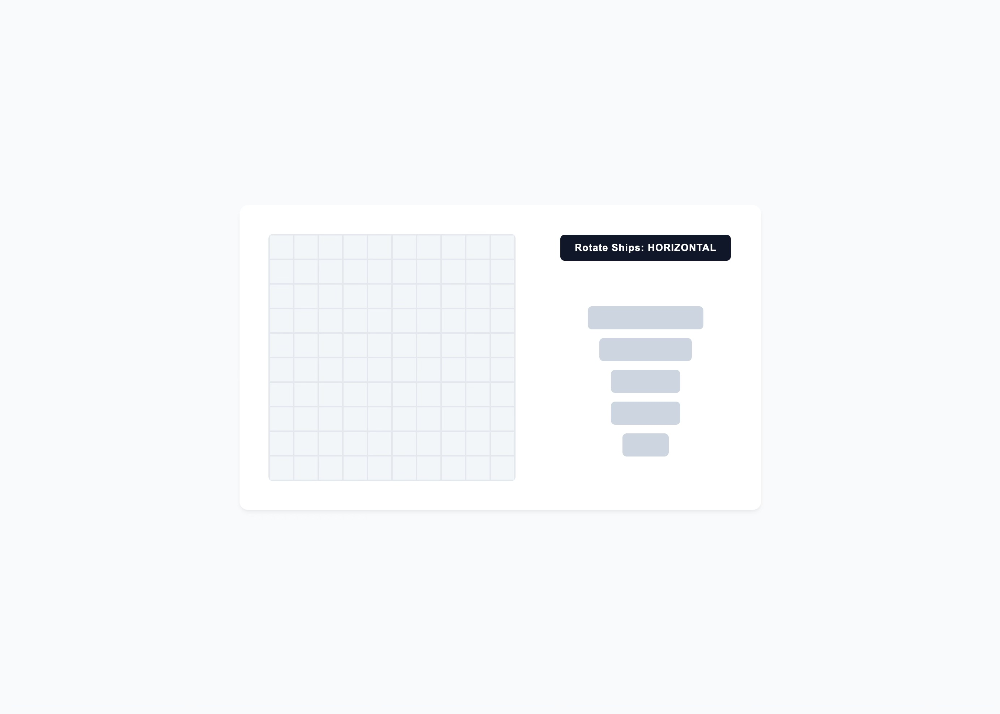
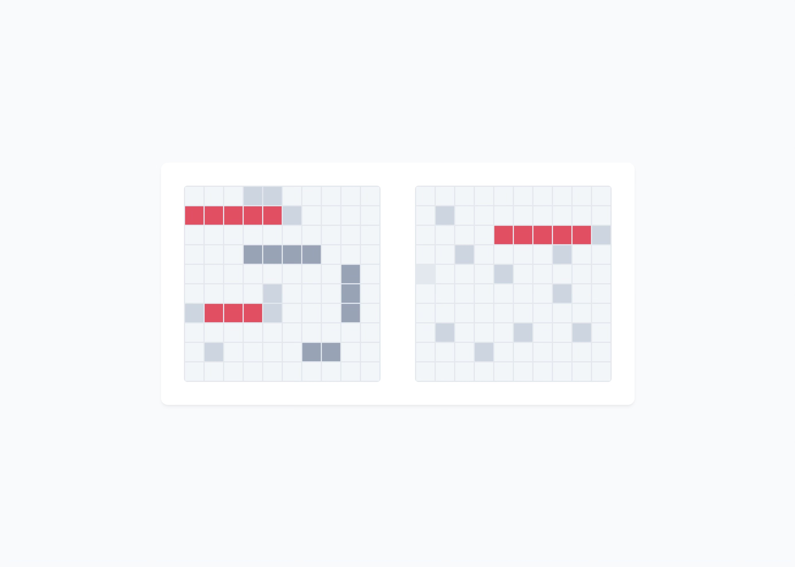
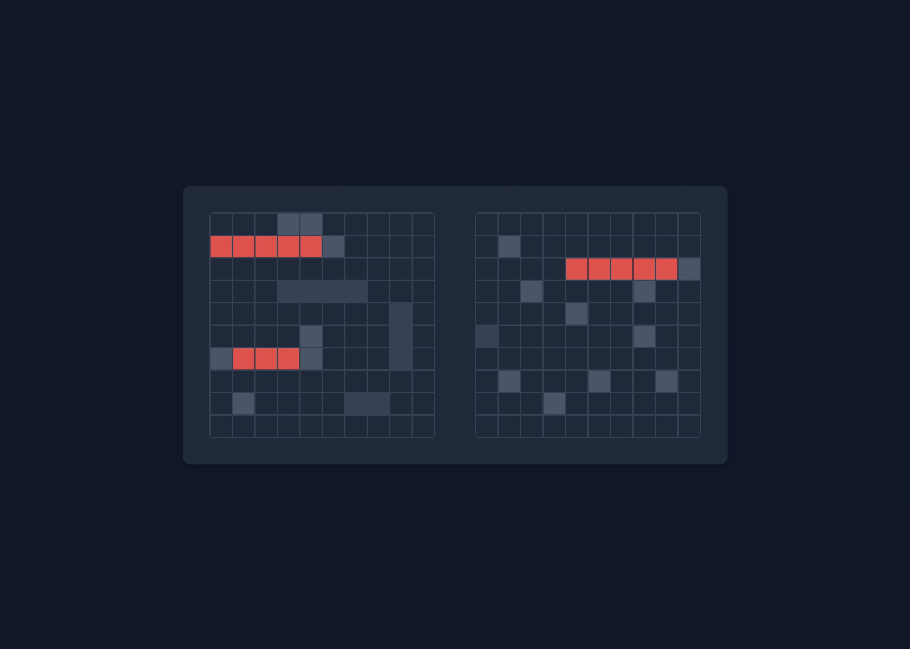

# Battleship AI

**A modular, Webpack-bundled Battleship engine featuring predictive Line-Intelligence AI and system-aware themes.**

## Visual Demonstration

| Light Mode                                                             | Dark Mode                                                            |
| :--------------------------------------------------------------------- | :------------------------------------------------------------------- |
|  |  |
|              |              |

> **Note:** Automatically detects your operating system's theme preferences and displays a minimalist, tactile layout in either Light or Dark mode natively.

## Key Features

- **Anchor-Corrected Drag & Drop:** Computes mouse pixel offsets (`e.offsetX` / `e.offsetY`) the exact millisecond a drag starts, ensuring ships snap directly underneath your cursor precisely onto the grid cells you choose.
- **Expert AI (Hunt & Target Algorithm):** The computer player plays dynamically. It sweeps the board randomly in **Hunt Mode** until it scores a hit. It then shifts to **Target Mode**, collecting adjacent targets and locking onto a single horizontal or vertical axis the moment a secondary hit confirms a ship's alignment.
- **Jank-Free Layout Buffer:** Implements a strict, rigid layout buffer zone for ship adjustments, allowing you to flip orientations instantly without causing the overall game container to shift or twitch.

## Technical Decisions

### 1. Pure Model-View-Controller (MVC) Split

- `ship.js` manages individual object health states, tracker hits, and sinking conditions independently.
- `gameboard.js` controls the core matrix layer, running defensive checks for out-of-bounds placements, ship collisions, and attack routing.
- `player.js` dictates human identities and houses the entire target-stack logic tree for the computer player.
- `gamecontroller.js` orchestrates turn distribution, state transitions, and absolute victory evaluation.
- `dom.js` acts as a pure presentation layer, transforming raw JavaScript array structures into live grid layouts.

## How to Run This Locally

1. Clone the repository to your local machine.
2. Navigate into the project directory.
3. Install dependencies: in your terminal, enter `npm install`.
4. Launch the Webpack local development server: in your terminal, enter `npm start`.
5. Navigate to `http://localhost:8080` (or the specific local address flagged in your terminal output).
